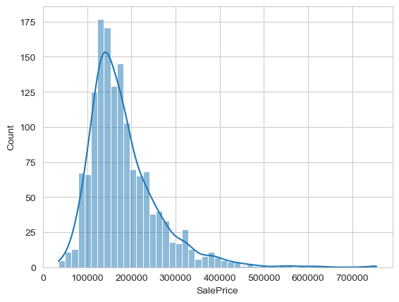
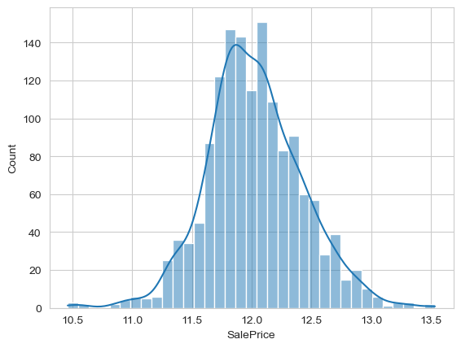
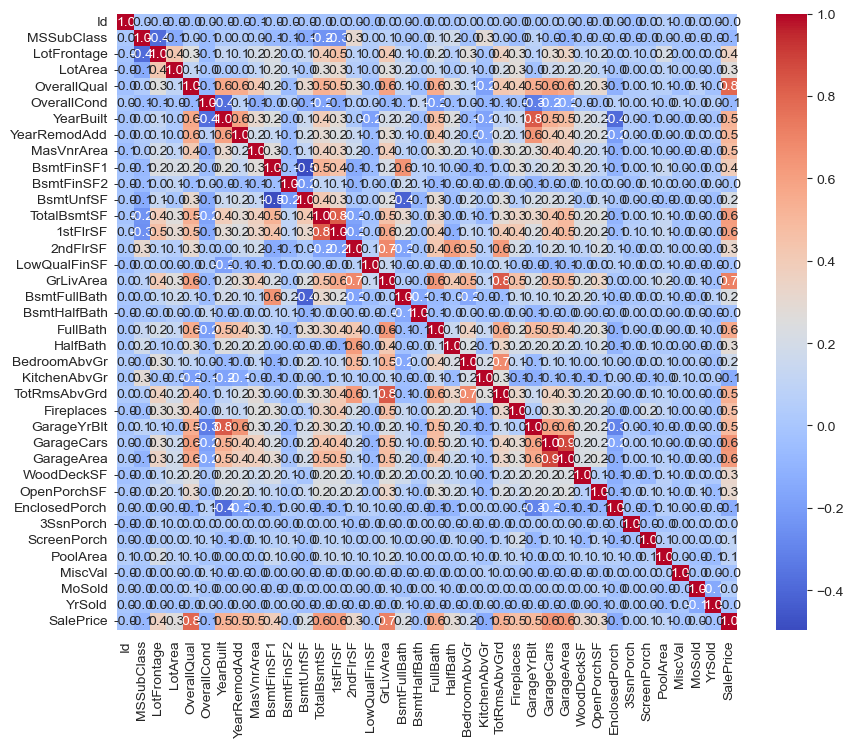
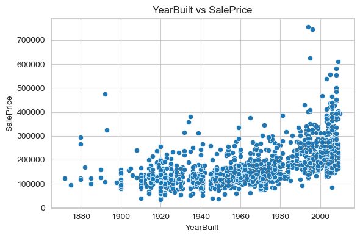
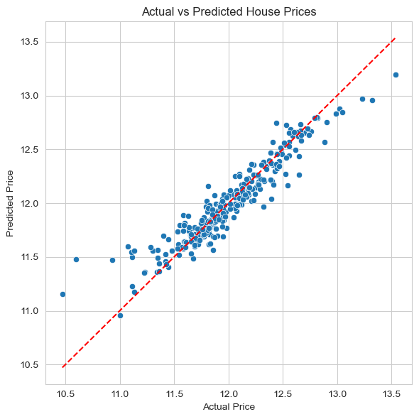

# 🏠 House Price Prediction  
**Machine Learning Regression Project**

---

## 📌 Problem Statement

Accurately predicting house prices is essential for buyers, sellers, and real estate investors. This project develops a machine learning model to estimate house prices based on property features.

---

## 🎯 Objective

- Analyze housing data to identify key factors influencing price  
- Build regression models for price prediction  
- Compare model performance using RMSE  
- Select the most effective model  

---

## 📊 Dataset

- Source: Public housing dataset (Kaggle)  
- Type: Structured tabular data  

### Key Features:
- Property size / area  
- Number of bedrooms and bathrooms  
- Location-related attributes  
- Additional housing characteristics  

---

## 🧠 Machine Learning Approach

### 🔹 Workflow

1. Data Cleaning  
2. Exploratory Data Analysis (EDA)  
3. Feature Engineering  
4. Data Preprocessing (scaling & encoding)  
5. Model Training  
6. Model Evaluation  

---

### 🔹 Models Used

- Linear Regression  
- Ridge Regression  
- Lasso Regression  
- Random Forest Regressor ✅ *(Final Model)*  

---

## 📊 Evaluation Metric

### Root Mean Squared Error (RMSE)

- Measures the average magnitude of prediction error  
- Penalizes larger errors more heavily  
- Lower RMSE indicates better model performance  

---

## 📈 Key Insights

- House prices are influenced by multiple interacting features  
- Linear models provide a strong baseline for comparison  
- Regularization (Ridge & Lasso) helps reduce overfitting  
- Random Forest captures non-linear relationships more effectively  

---

## ⚖️ Model Comparison

| Model               | RMSE  |
|--------------------|-------|
| Linear Regression  | 2.721 |
| Ridge Regression   | 1.154 |
| Lasso Regression   | 0.150 |
| Random Forest ✅    | 0.149 |

---

## 🧠 Model Selection

Random Forest was selected as the final model because:

- Achieved the lowest RMSE  
- Captured complex, non-linear relationships  
- Provided more stable and robust predictions  

---

## 📊 Visualizations
### 📊 Target Distribution
  

### 📊 Target Distribution (Log)
  

### 📊 Feature Correlation
  

### 📊 Feature vs Target
  

### 📊 Random Forest Prediction
  

---

## 🔧 Tech Stack

- Python  
- Pandas / NumPy  
- Scikit-learn  
- Matplotlib / Seaborn  
- Jupyter Notebook  

---

## ⚠️ Limitations

- Model performance depends on dataset quality  
- Limited feature set may reduce prediction accuracy  
- May not generalize across different locations  

---

## 🚀 Future Improvements

- Incorporate additional location-based features  
- Perform advanced hyperparameter tuning  
- Explore gradient boosting models (XGBoost, LightGBM)  
- Deploy as an interactive web application  

---

## 👤 Author

**Jackson Lee**  
Data Science & Machine Learning  

---

## ⭐ Highlight

This project demonstrates:
- End-to-end regression workflow  
- Application of regularization techniques (Ridge & Lasso)  
- Model comparison using RMSE  
- Understanding of linear vs non-linear modeling  

---